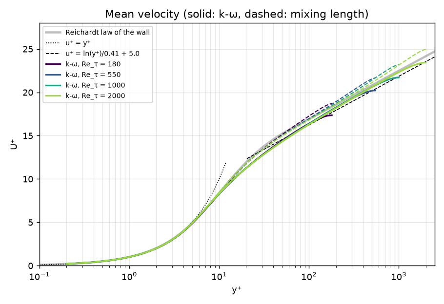
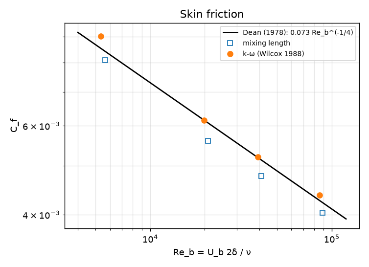
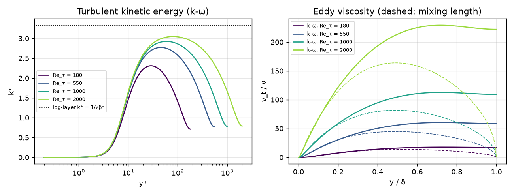

# Turbulent Channel Flow: RANS Models

[](https://github.com/cfdgasman/turbulent-channel-rans/actions/workflows/ci.yml)

A 1D solver for **fully developed turbulent channel flow** with two RANS closures: the **Prandtl mixing-length** model with van Driest damping, and the **Wilcox (1988) k-ω** model. Both are integrated through the viscous sublayer to the wall, with no wall functions. Results are validated against the **law of the wall** and **Dean's skin-friction correlation** for Re<sub>τ</sub> = 180–2000.

<p align="center"></p>

## Equations

In wall units (δ = 1, u<sub>τ</sub> = 1, ν = 1/Re<sub>τ</sub>) the mean-momentum balance is

$$ \frac{d}{dy}\Big[(\nu+\nu_t)\frac{dU}{dy}\Big] = -1, \qquad U(0)=0,\quad U'(1)=0 $$

| Model | Closure |
|---|---|
| **Mixing length** | ν<sub>t</sub> = ℓ²\|U′\|, ℓ = ℓ<sub>Nikuradse</sub>(y)·(1 − e<sup>−y⁺/26</sup>). The stress balance (ν + ℓ²U′)U′ = 1 − y is solved exactly at each point, then integrated. |
| **k-ω (Wilcox 1988)** | ν<sub>t</sub> = k/ω, with transport equations for k and ω; α = 5/9, β = 3/40, β* = 9/100, σ = σ* = ½; wall value ω<sub>w</sub> = 60ν/(β y₁²) (Menter) |

**Numerics (k-ω).** A cell-vertex finite-volume scheme on a tanh-clustered grid with the first point at y⁺ ≈ 0.2. Destruction terms are treated implicitly, and each equation is solved with a tridiagonal system inside a Picard loop. Plain Picard iteration settles into a **period-2 oscillation** between two states, so the eddy viscosity is under-relaxed (0.1). The test suite checks that the converged solution satisfies the exact total-stress balance (ν + ν<sub>t</sub>)U′ = 1 − y.

## Results

| Re<sub>τ</sub> | Model | U<sub>b</sub>⁺ | Re<sub>b</sub> | C<sub>f</sub> | C<sub>f</sub> Dean | Error | Log-law B |
|---|---|---|---|---|---|---|---|
| 180 | mixing length | 15.72 | 5 659 | 0.00809 | 0.00842 | −3.8 % | – |
| 180 | k-ω | 14.89 | 5 361 | 0.00902 | 0.00853 | +5.7 % | – |
| 550 | mixing length | 18.90 | 20 788 | 0.00560 | 0.00608 | −7.9 % | 5.62 |
| 550 | k-ω | 18.03 | 19 831 | 0.00615 | 0.00615 | **+0.0 %** | 5.01 |
| 1000 | mixing length | 20.47 | 40 950 | 0.00477 | 0.00513 | −7.0 % | 5.64 |
| 1000 | k-ω | 19.60 | 39 209 | 0.00520 | 0.00519 | **+0.3 %** | 5.09 |
| 2000 | mixing length | 22.26 | 89 032 | 0.00404 | 0.00423 | −4.5 % | 5.64 |
| 2000 | k-ω | 21.38 | 85 531 | 0.00437 | 0.00427 | **+2.5 %** | 5.14 |

<p align="center">

</p>
<p align="center"></p>

**Observations**
- **k-ω** recovers the log law with an intercept B ≈ 5.0–5.1, and matches Dean's C<sub>f</sub> within **0–2.5 %** for Re<sub>τ</sub> ≥ 550. At Re<sub>τ</sub> = 180 it over-predicts C<sub>f</sub> by 6 %, a known low-Reynolds-number weakness of the standard model, since it has no near-wall damping functions.
- **k⁺** approaches the log-layer equilibrium value 1/√β* ≈ 3.33 as Re<sub>τ</sub> increases.
- **Mixing length** gives a good near-wall profile but under-predicts friction by 4–8 %. Its eddy viscosity drops to zero at the centreline, where U′ = 0. That is unphysical, and k-ω does not have this problem.

## Usage

```bash
pip install -r requirements.txt
python run.py     # table + figures in docs/
pytest
```

## References

D. C. Wilcox, *Reassessment of the scale-determining equation for advanced turbulence models*, AIAA J. 26 (1988) 1299–1310.
R. B. Dean, *Reynolds number dependence of skin friction and other bulk flow variables in two-dimensional rectangular duct flow*, J. Fluids Eng. 100 (1978) 215–223.
H. Reichardt, *Vollständige Darstellung der turbulenten Geschwindigkeitsverteilung in glatten Leitungen*, ZAMM 31 (1951) 208–219.

## License

MIT
